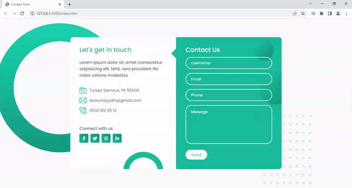

<h1>Responsive Contact Us</h1>

<h3>Kullanılan Teknolojiler</h3>

<h3>Javacript - HTML5 - CSS3</h3>

*<b>JS</b> teknolojisi kullanılarak <b>resposive</b> yapıda bir iletişim sayfası tasarımı 
*Dinamik yapıda ve estetik görünüme sahip  
*<b>CSS</b> stillendirmelerinde kullanıcı kollanım kolaylığı ve renk uyumu gözönünde bulundurulmuştur. 
*<b>Responsive</b> yapısı sayesinde <b><i>Bilgisayar && Tablet && Telefon</i></b> ekran görünümlerindeki tarayıcılara uygundur. 
*<b>Javacript</b> de <b>DOM</b> yapısı ile form içerisindeki <i>input</i>'lardaki giriş kontrolleri ve sorguları sağlandı. 

<a href="https://responsive-contactus.netlify.app/">Canlı Önizleme</a>

